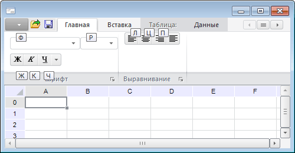

# IBaseRibbonElement.Keys

IBaseRibbonElement.Keys
-

# IBaseRibbonElement.Keys

## Синтаксис

Keys: String;

## Описание

Свойство Keys определяет горячую
 клавишу, которая будет использоваться для быстрого доступа к элементу
 управления.

## Комментарии

В качестве значения данного свойства необходимо указать символ, либо
 сочетание из двух символов. Символы должны соответствовать буквенной,
 либо цифровой клавише. Если указывается сочетание из двух символов, то
 ни с одной из вкладок (элементом управления) не должна быть сопоставлена
 первая буква из сочетания.

Во время работы формы для доступа к элементам управления с помощью горячих
 клавиш необходимо нажать клавишу ALT. При этом будут отображены всплывающие
 подсказки с наименованием установленных горячих клавиш. Подсказки для
 элементов управления отображаются после доступа с помощью горячей клавиши
 к вкладке, на которой они расположены:

См. также:

[IBaseRibbonElement](IBaseRibbonElement.htm)

		Справочная
		 система на версию 10.9
		 от 18/08/2025,
		 © ООО «ФОРСАЙТ»,
