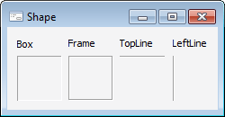

# IBevel.Shape

IBevel.Shape
-

# IBevel.Shape

## Синтаксис

Shape: [BevelShape](../../Enums/BevelShape.htm);

## Описание

Свойство Shape определяет внешний
 вид компонента.

## Пример

См.также:

[IBevel](IBevel.htm)

		Справочная
		 система на версию 10.9
		 от 18/08/2025,
		 © ООО «ФОРСАЙТ»,
