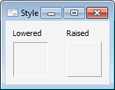

# IBevel.Style

IBevel.Style
-

# IBevel.Style

## Синтаксис

Style: [BevelStyle](../../Enums/BevelStyle.htm);

## Описание

Свойство Style определяет стиль
 оформления компонента.

## Пример

См.также:

[IBevel](IBevel.htm)

		Справочная
		 система на версию 10.9
		 от 18/08/2025,
		 © ООО «ФОРСАЙТ»,
