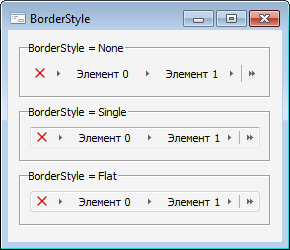

# IBreadcrumb.BorderStyle

IBreadcrumb.BorderStyle
-

# IBreadcrumb.BorderStyle

## Синтаксис

BorderStyle: [ControlBorderStyle](../../Enums/ControlBorderStyle.htm);

## Описание

Свойство BorderStyle определяет
 стиль границ компонента.

## Пример

См. также:

[IBreadcrumb](IBreadcrumb.htm)

		Справочная
		 система на версию 10.9
		 от 18/08/2025,
		 © ООО «ФОРСАЙТ»,
