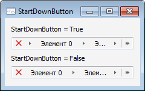

# IBreadcrumb.StartDownButton

IBreadcrumb.StartDownButton
-

# IBreadcrumb.StartDownButton

## Синтаксис

StartDownButton: Boolean;

## Описание

Свойство StartDownButton определяет
 признак отображения дополнительной кнопки после кнопки удаления элементов.

## Комментарии

По умолчанию свойству установлено значение True,
 при этом после кнопки удаления будет отображаться дополнительная кнопка
 - «». Если свойству установить значение
 False, то дополнительная кнопка
 будет отсутствовать.

## Пример

См. также:

[IBreadcrumb](IBreadcrumb.htm)

		Справочная
		 система на версию 10.9
		 от 18/08/2025,
		 © ООО «ФОРСАЙТ»,
