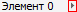

# IBreadcrumbItem.DownButton

IBreadcrumbItem.DownButton
-

# IBreadcrumbItem.DownButton

## Синтаксис

DownButton: Boolean;

## Описание

Свойство DownButton определяет
 признак отображения рядом с элементом дополнительной кнопки.

## Комментарии

Если свойству установлено значение True, то рядом с наименованием элемента
 будет отображаться дополнительная кнопка: .

При нажатии на данную кнопку будет генерироваться событие [OnButtonClick](../../Class/Breadcrumb/Breadcrumb.OnButtonClick.htm).
 Обработка события может использоваться для вызова дополнительных всплывающих
 меню, либо иных действий, связанных с элементом.

См.
 также:

[IBreadcrumbItem](IBreadcrumbItem.htm)

		Справочная
		 система на версию 10.9
		 от 18/08/2025,
		 © ООО «ФОРСАЙТ»,
