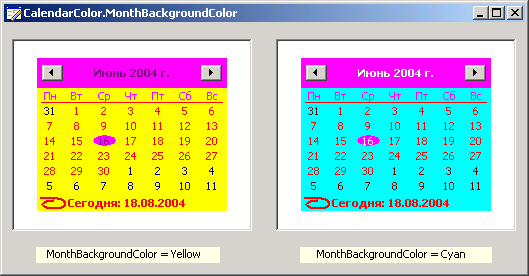

# ICalendarColors.MonthBackgroundColor

ICalendarColors.MonthBackgroundColor
-

# ICalendarColors.MonthBackgroundColor

## Синтаксис

MonthBackgroundColor: [IGxColor](ModDrawing.chm::/Interface/IGxColor/IGxColor.htm);

## Описание

Свойство MonthBackgroundColor
 определяет цвет фона, на котором располагаются названия месяцев.

## Комментарии

Изменение цветового оформления календаря не доступно в операционной
 системе Windows 7 при использовании темы оформления Aero и в более поздних
 операционных системах.

## Пример

См.также:

[ICalendarColors](ICalendarColors.htm)

		Справочная
		 система на версию 10.9
		 от 18/08/2025,
		 © ООО «ФОРСАЙТ»,
