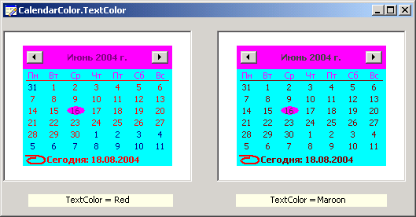

# ICalendarColors.TextColor

ICalendarColors.TextColor
-

# ICalendarColors.TextColor

## Синтаксис

TextColor: [IGxColor](ModDrawing.chm::/Interface/IGxColor/IGxColor.htm);

## Описание

Свойство TextColor определяет
 цвет чисел текущего месяца.

## Пример

См.также:

[ICalendarColors](ICalendarColors.htm)

		Справочная
		 система на версию 10.9
		 от 18/08/2025,
		 © ООО «ФОРСАЙТ»,
