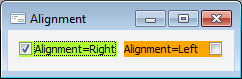

# ICheckBox.Alignment

ICheckBox.Alignment
-

# ICheckBox.Alignment

## Синтаксис

Alignment: [LeftRight](../../Enums/LeftRight.htm);

## Описание

Свойство Aligment определяет
 выравнивание текста в компоненте.

## Пример

См.также:

[ICheckBox](ICheckBox.htm)

		Справочная
		 система на версию 10.9
		 от 18/08/2025,
		 © ООО «ФОРСАЙТ»,
