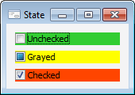

# ICheckBox.State

ICheckBox.State
-

# ICheckBox.State

## Синтаксис

State: [CheckBoxState](../../Enums/CheckBoxState.htm);

## Описание

Свойство State определяет состояние
 флажка компонента.

## Комментарии

Промежуточное состояние (Grayed) допускается только в случае, если свойству
 [AllowGrayed](ICheckBox.AllowGrayed.htm)
 установлено значение True. Если
 [AllowGrayed](ICheckBox.AllowGrayed.htm)
 = False (значение по умолчанию),
 то допускаются только два состояния: Отмечен (Checked) и Не отмечен (Unchecked).

## Пример

См. также:

[ICheckBox](ICheckBox.htm)

		Справочная
		 система на версию 10.9
		 от 18/08/2025,
		 © ООО «ФОРСАЙТ»,
