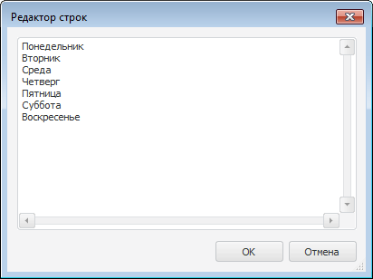

# IComboBox.Items

IComboBox.Items
-

# IComboBox.Items

## Синтаксис

Items: [IStringList](ModCollections.chm::/Interface/IStringList/IStringList.htm);

## Описание

Свойство Items определяет коллекцию
 строк раскрывающегося списка.

## Комментарии

В режиме дизайнера формы список строк задается в диалоге «Редактор строк».
 Диалог вызывается при нажатии на кнопку  в области
 свойства Items в инспекторе объектов.

Если у формы, на которой расположен компонент, установлено свойство
 [Resources](../IFormControl/IFormControl.Resources.htm), то
 для свойства Items в инспекторе
 объектов будет добавлен дополнительный атрибут «ResourcesID»,
 позволяющий определить элемент [ресурсов](UiNav.chm::/Multilanguage/Resources.htm),
 из которого будут браться значения для компонента. Значение данного атрибута
 будет формироваться автоматически и состоять из имени компонента, содержащего
 объект, и имени объекта, разделенных точками.

При изменении значения свойства Items
 будет изменено значение соответствующего элемента [ресурсов](UiNav.chm::/Multilanguage/Resources.htm)
 для языка по умолчанию.

При изменении значения атрибута «ResourcesID»
 будет изменен идентификатор соответствующего элемента, в подключенных
 к форме [ресурсах](UiNav.chm::/Multilanguage/Resources.htm).

См. также:

[IComboBox](IComboBox.htm)

		Справочная
		 система на версию 10.9
		 от 18/08/2025,
		 © ООО «ФОРСАЙТ»,
