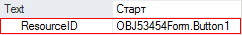
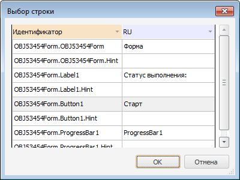

# IControl.Text

IControl.Text
-

# IControl.Text

## Синтаксис

Text: String;

## Описание

Свойство Text определяет строку,
 идентифицирующую компонент для пользователя. Оно связывает с компонентом
 некоторую строку текста, поясняющую пользователю назначение данного компонента.

## Комментарии

По умолчанию Text совпадает
 с названием компонента. Для управляющих компонентов (кнопок, флажков,
 переключателей и т.п) в свойстве Text
 можно указывать символ быстрого доступа. Для этого перед соответствующим
 символом следует поставить знак амперсанда – &. Следующий после амперсанда
 символ отображается подчеркнутым и будет являться символом быстрого доступа:
 при выполнении формы нажатие этого символа или сочетания ALT+символ будет
 эквивалентно выбору соответствующего управляющего компонента. При этом
 также генерируется событие [OnClick](IControl.OnClick.htm)
 для компонента.

Если в тексте строки Text надо
 ввести символ амперсанда, его надо повторить дважды: &&.

Если у формы, на которой расположен компонент, установлено свойство
 [Resources](../IFormControl/IFormControl.Resources.htm), то
 для свойства Text в инспекторе
 объектов будет добавлено дополнительное свойство «ResourcesID»,
 позволяющее определить элемент [ресурсов](UiNav.chm::/Multilanguage/Resources.htm),
 из которого будут браться значения свойства:

При изменении значения свойства Text,
 будет изменено значение соответствующего элемента [ресурсов](UiNav.chm::/Multilanguage/Resources.htm)
 для языка по умолчанию.

При изменении значения свойства «ResourcesID»,
 будет изменен идентификатор соответствующего элемента, в подключенных
 к форме [ресурсах](UiNav.chm::/Multilanguage/Resources.htm).
 Для сопоставления текстового свойства компонента с другим строковым элементом
 ресурса необходимо нажать кнопку  в поле
 «ResourcesID». Будет открыт диалог
 «Выбор строки»:

В диалоге содержатся все строковые элементы ресурсов, подключенных к
 форме. Для каждого элемента ресурсов отображается значение идентификатора
 и значение для языка по умолчанию. После выбора нового строкового элемента
 необходимо нажать кнопку «ОК».

См. также:

[IControl](IControl.htm) | [Перевод в ресурсах](UiNav.chm::/Multilanguage/Resources.htm)

		Справочная
		 система на версию 10.9
		 от 18/08/2025,
		 © ООО «ФОРСАЙТ»,
