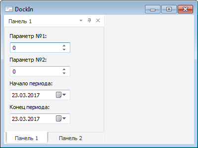
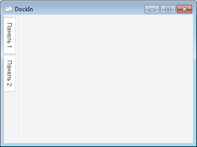

# IControlBar.DockIn

IControlBar.DockIn
-

# IControlBar.DockIn

## Синтаксис

DockIn(Bar: [IControlBar](IControlBar.htm)):
 Boolean;

## Параметры

Bar. Всплывающая панель, с
 которой необходимо сгруппировать текущую всплывающую панель.

## Описание

Метод DockIn осуществляет группировку
 текущей всплывающей панели с панелью, передаваемой посредством входного
 параметра.

## Комментарии

В сгруппированном состоянии изменение свойств, определяющих положение
 одной панели, вызывает изменение положения всей группы. В скрытом состоянии
 вкладки панелей располагаются рядом, в припаркованном и плавающем – для
 панелей создается одно общее окно, внизу которого отображаются вкладки
 с наименованием панелей. Группируемая панель добавляется в конец группы.

## Пример

 

См.также:

[IControlBar](IControlBar.htm)

		Справочная
		 система на версию 10.9
		 от 18/08/2025,
		 © ООО «ФОРСАЙТ»,
