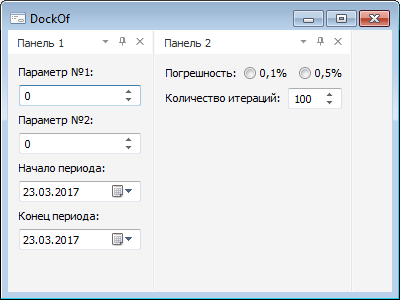
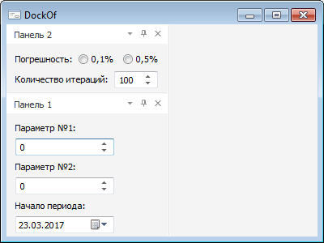

# IControlBar.DockOf

IControlBar.DockOf
-

# IControlBar.DockOf

## Синтаксис

DockOf(Bar: [IControlBar](IControlBar.htm);
 Position: [StartDockPosition](../../Enums/StartDockPosition.htm)):
 Boolean;

## Параметры

Bar. Всплывающая панель, с которой необходимо
 сгруппировать данную.

Position. Позиция, в которую
 помещается данная панель, относительно панели, передаваемой посредством
 параметра Bar.

## Описание

Метод DockOf осуществляет "парковку"
 данной панели к панели, передаваемой посредством параметра Bar.

## Пример

 

См.также:

[IControlBar](IControlBar.htm)

		Справочная
		 система на версию 10.9
		 от 18/08/2025,
		 © ООО «ФОРСАЙТ»,
