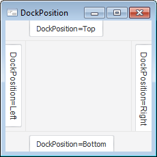

# IControlBar.DockPosition

IControlBar.DockPosition
-

# IControlBar.DockPosition

## Синтаксис

DockPosition: [StartDockPosition](../../Enums/StartDockPosition.htm);

## Описание

Свойство DockPosition определяет
 край родительского окна, к которому будет прикреплена всплывающая панель.

## Пример

См.также:

[IControlBar](IControlBar.htm)

		Справочная
		 система на версию 10.9
		 от 18/08/2025,
		 © ООО «ФОРСАЙТ»,
