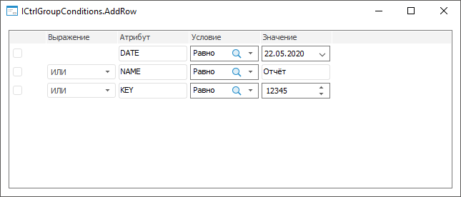

# ICtrlGroupConditions.AddRow

ICtrlGroupConditions.AddRow
-

# ICtrlGroupConditions.AddRow

## Синтаксис

AddRow(Value: [ConditionOperatorType](../../Enums/ConditionOperatorType.htm)):
 [IListViewItem](../IListViewItem/IListViewItem.htm);

## Параметры

Value. Оператор, который будет
 использоваться в выражении при группировке добавляемого элемента с другим
 элементом компонента.

## Описание

Метод AddRow добавляет элемент.

## Комментарии

Элемент добавляется с заданным выражением после всех существующих элементов
 в компоненте.

Для добавления элемента по указанному индексу используйте метод [ICtrlGroupConditions.InsertRow](ICtrlGroupConditions.InsertRow.htm).

Для группировки отмеченных элементов используйте метод [ICtrlGroupConditions.Group](ICtrlGroupConditions.Group.htm).

Для группировки элементов по индексу используйте метод [ICtrlGroupConditions.GroupByIndexes](ICtrlGroupConditions.GroupByIndexes.htm).

## Пример

Для выполнения примера добавьте на [форму](UiDevEnv.chm::/01_Development_Environment/02_Work_in_Development_Environment/DevEnv_Object/DevEnv_Form.htm)
 компонент [CtrlGroupConditions](UiDevEnv.chm::/02_Components_constructor_forms/02_Additional_components/CtrlGroupConditions.htm)
 c наименованием CtrlGroupConditions1.

Добавьте ссылку на системную сборку Forms.

Пример является обработчиком события [OnCreate](../../Class/Form/Form.OnCreate.htm)
 для формы.

	Sub TESTFormOnCreate(Sender: Object; Args: IEventArgs);

	Var

	    Columns: IListViewColumns;

	    Attr, Condition, Value: IListViewColumn;

	    AttrEditBox, AttrEditBox2, AttrEditBox3, AttrEditBox4: IEditBox;

	    List, List2, List3: ITreeCombo;

	    Date: IDateTimePicker;

	    ValueEdit: IIntegerEdit;

	Begin

	    // Определим столбцы

	    Columns := CtrlGroupConditions1.Columns;

	    Attr := Columns.Add;

	    Attr.Caption := "Атрибут";

	    Condition := Columns.Add;

	    Condition.Caption := "Условие";

	    Value := Columns.Add;

	    Value.Caption := "Значение";

	    // Добавим первый элемент

	    CtrlGroupConditions1.AddRow(ConditionOperatorType.Or_);

	    // Добавим визуальный компонент для столбца «Атрибут»

	    AttrEditBox := New EditBox.Create;

	    AttrEditBox.Text := "DATE";

	    CtrlGroupConditions1.InsertControl(AttrEditBox, 2, 0);

	    // Добавим визуальный компонент для столбца «Условие»

	    List := New TreeCombo.Create;

	    List.Nodes.Add(Null, "Равно").Selected := True;

	    List.Nodes.Add(Null, "Не равно");

	    List.Nodes.Add(Null, "Меньше");

	    List.Nodes.Add(Null, "Больше");

	    List.Nodes.Add(Null, "Меньше или равно");

	    List.Nodes.Add(Null, "Больше или равно");

	    List.SelectionMode := SelectionModeType.SingleSelect;

	    CtrlGroupConditions1.InsertControl(List, 3, 0);

	    // Добавим визуальный компонент для столбца «Значение»

	    Date := New DateTimePicker.Create;

	    CtrlGroupConditions1.InsertControl(Date, 4, 0);

	    // Добавим второй элемент

	    CtrlGroupConditions1.AddRow(ConditionOperatorType.Or_);

	    // Добавим визуальный компонент для столбца «Атрибут»

	    AttrEditBox2 := New EditBox.Create;

	    AttrEditBox2.Text := "NAME";

	    CtrlGroupConditions1.InsertControl(AttrEditBox2, 2, 1);

	    // Добавим визуальный компонент для столбца «Условие»

	    List2 := New TreeCombo.Create;

	    List2.Nodes.Add(Null, "Равно").Selected := True;

	    List2.Nodes.Add(Null, "Не равно");

	    List2.Nodes.Add(Null, "Меньше");

	    List2.Nodes.Add(Null, "Больше");

	    List2.Nodes.Add(Null, "Меньше или равно");

	    List2.Nodes.Add(Null, "Больше или равно");

	    List2.SelectionMode := SelectionModeType.SingleSelect;

	    CtrlGroupConditions1.InsertControl(List2, 3, 1);

	    // Добавим визуальный компонент для столбца «Значение»

	    AttrEditBox3 := New EditBox.Create;

	    AttrEditBox3.Text := "Отчёт";

	    CtrlGroupConditions1.InsertControl(AttrEditBox3, 4, 1);

	    // Добавим третий элемент

	    CtrlGroupConditions1.AddRow(ConditionOperatorType.Or_);

	    // Добавим визуальный компонент для столбца «Атрибут»

	    AttrEditBox4 := New EditBox.Create;

	    AttrEditBox4.Text := "KEY";

	    CtrlGroupConditions1.InsertControl(AttrEditBox4, 2, 2);

	    // Добавим визуальный компонент для столбца «Условие»

	    List3 := New TreeCombo.Create;

	    List3.Nodes.Add(Null, "Равно").Selected := True;

	    List3.Nodes.Add(Null, "Не равно");

	    List3.Nodes.Add(Null, "Меньше");

	    List3.Nodes.Add(Null, "Больше");

	    List3.Nodes.Add(Null, "Меньше или равно");

	    List3.Nodes.Add(Null, "Больше или равно");

	    List3.SelectionMode := SelectionModeType.SingleSelect;

	    CtrlGroupConditions1.InsertControl(List3, 3, 2);

	    // Добавим визуальный компонент для столбца «Значение»

	    ValueEdit := New IntegerEdit.Create;

	    ValueEdit.Value := 12345;

	    CtrlGroupConditions1.InsertControl(ValueEdit, 4, 2);

	End Sub TESTFormOnCreate;

После выполнения примера в компоненте CtrlGroupConditions
 будут определены столбцы и добавлены три элемента с визуальными компонентами:

См. также:

[ICtrlGroupConditions](ICtrlGroupConditions.htm)

		Справочная
		 система на версию 10.9
		 от 18/08/2025,
		 © ООО «ФОРСАЙТ»,
