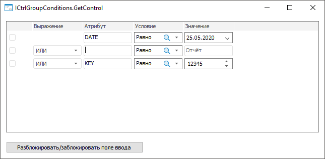
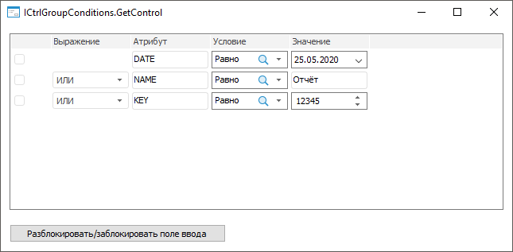

# ICtrlGroupConditions.GetControl

ICtrlGroupConditions.GetControl
-

# ICtrlGroupConditions.GetControl

## Синтаксис

GetControl(Column: Integer; Row: Integer): [IControl](../IControl/IControl.htm);

## Параметры

Column. Индекс столбца, в котором
 содержится визуальный компонент;

Row. Индекс строки, в которой
 содержится визуальный компонент.

## Описание

Метод GetControl возвращает
 визуальный компонент, добавленный в ячейку элемента.

## Комментарии

Для добавления визуального компонента в ячейку элемента используйте
 метод [IListView.InsertControl](../IListView/IListView.InsertControl.htm).

## Пример

Для выполнения примера создайте форму, приведённую в примере для метода
 [ICtrlGroupConditions.AddRow](ICtrlGroupConditions.AddRow.htm).
 Добавьте на форму кнопку с наименованием Button1 и установите свойству
 Text значение «Разблокировать/заблокировать
 поле ввода».

Добавьте ссылку на системную сборку Forms.

Пример является обработчиком события [OnClick](../IControl/IControl.OnClick.htm)
 для компонента Button1.

	Sub Button1OnClick(Sender: Object; Args: IMouseEventArgs);

	Var

	    Control, AttrControl: IControl;

	Begin

	    // Получим визуальные компоненты из третьего и пятого столбца второй строки

	    Control := CtrlGroupConditions1.GetControl(4, 1);

	    AttrControl := CtrlGroupConditions1.GetControl(2, 1);

	    // Выполним проверку содержимого компонента в третьем столбце и определим доступность компонента в пятом столбце

	    If AttrControl.Text = "" Then

	        Control.Enabled := False;

	    Else

	        Control.Enabled := True;

	    End If;

	End Sub Button1OnClick;

После выполнения примера на форму будет добавлена кнопка для блокировки/разблокировки
 поля ввода в пятом столбце второй строки.

При нажатии на кнопку «Разблокировать/заблокировать
 поле ввода» будет выполняться проверка содержимого поля в третьем
 столбце второй строки. Если поле в третьем столбце пусто, то поле ввода
 в пятом столбце будет заблокировано:

Если поле в третьем столбце заполнено, то поле ввода в пятом столбце
 будет разблокировано:

См. также:

[ICtrlGroupConditions](ICtrlGroupConditions.htm)

		Справочная
		 система на версию 10.9
		 от 18/08/2025,
		 © ООО «ФОРСАЙТ»,
