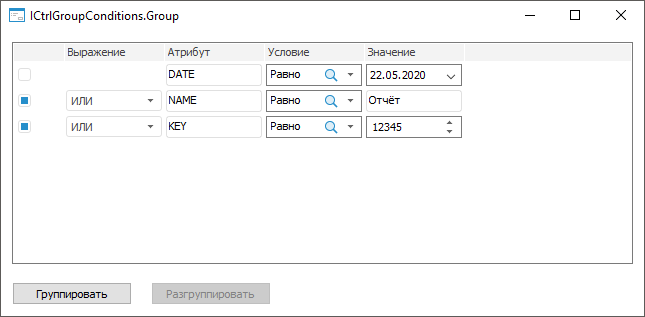
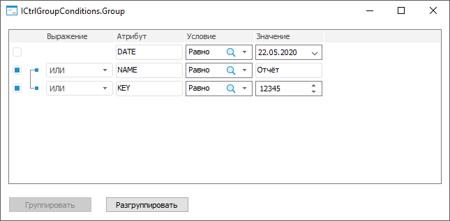
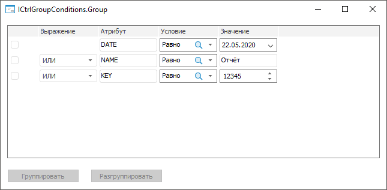

# ICtrlGroupConditions.Group

ICtrlGroupConditions.Group
-

# ICtrlGroupConditions.Group

## Синтаксис

Group;

## Описание

Метод Group группирует отмеченные
 элементы.

## Комментарии

Группировка элементов доступна, если в компоненте последовательно отмечены
 хотя бы два элемента, которые не содержатся в других группах. Для определения
 массива отмеченных элементов используйте свойство [ICtrlGroupConditions.SelectedRows](ICtrlGroupConditions.SelectedRows.htm).

Для определения возможности группировки элементов используйте метод
 [ICtrlGroupConditions.CanGroup](ICtrlGroupConditions.CanGroup.htm).

Для группировки элементов по индексам используйте метод [ICtrlGroupConditions.GroupByIndexes](ICtrlGroupConditions.GroupByIndexes.htm).

## Пример

Для выполнения примера создайте [форму](UiDevEnv.chm::/01_Development_Environment/02_Work_in_Development_Environment/DevEnv_Object/DevEnv_Form.htm),
 приведенную в примере для метода [ICtrlGroupConditions.AddRow](ICtrlGroupConditions.AddRow.htm).
 Добавьте на форму два компонента [Button](UiDevEnv.chm::/02_Components_constructor_forms/01_Standart_Components/Button.htm) с наименованиями
 Button1 и Button2 соответственно. Для компонента Button1 установите свойству
 Text значение «Группировать»,
 для компонента Button2 - «Разгруппировать». Также для компонентов установите
 свойству Enabled значение False.

Добавьте ссылку на системную сборку Forms.

Пример является обработчиком события [OnChecked](../../Class/ListView/ListView.OnChecked.htm)
 для компонента CtrlGroupConditions1 и
 обработчиком событий [OnClick](../IControl/IControl.OnClick.htm)
 для компонентов Button1 и Button2.

					Sub CtrlGroupConditions1OnChecked(Sender: Object; Args: IListViewItemEventArgs);

		Var

		    Elements: Array Of Integer;

		Begin

		    // Получим отмеченные элементы

		    Elements := CtrlGroupConditions1.SelectedRows;

		    // Определим возможность группировки элементов

		    If CtrlGroupConditions1.CanGroup(Elements) Then

		        Button1.Enabled := True;

		    Else

		        Button1.Enabled := False;

		    End If;

		    // Определим возможность разгруппировки группы элементов

		    If CtrlGroupConditions1.CanUngroup(Elements) Then

		        Button2.Enabled := True;

		    Else

		        Button2.Enabled := False;

		    End If;

		End Sub CtrlGroupConditions1OnChecked;

		Sub Button1OnClick(Sender: Object; Args: IMouseEventArgs);

		Begin

		    // Сгруппируем элементы

		    CtrlGroupConditions1.Group;

		End Sub Button1OnClick;

		Sub Button2OnClick(Sender: Object; Args: IMouseEventArgs);

		Begin

		    // Разгруппируем группу элементов

		    CtrlGroupConditions1.Ungroup;

		End Sub Button2OnClick;

После выполнения примера на форму будут добавлены кнопки для группировки
 отмеченных элементов и разгруппировки отмеченной группы элементов. При
 отметке элементов будет определяться доступность кнопок, например:

При нажатии на кнопку «Группировать»
 будут сгруппированы отмеченные элементы:

При нажатии на кнопку «Разгруппировать»
 будет разгруппирована отмеченная группа элементов:

См. также:

[ICtrlGroupConditions](ICtrlGroupConditions.htm)

		Справочная
		 система на версию 10.9
		 от 18/08/2025,
		 © ООО «ФОРСАЙТ»,
