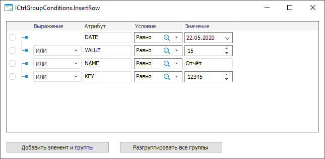
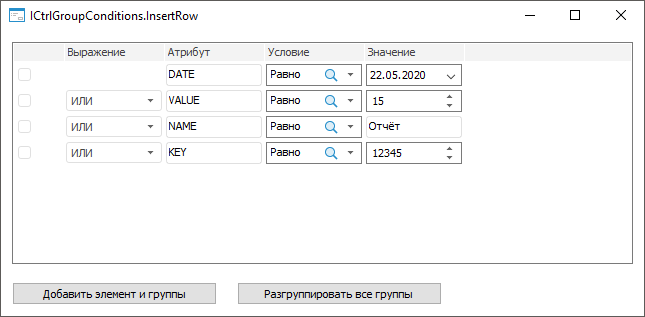

# ICtrlGroupConditions.InsertRow

ICtrlGroupConditions.InsertRow
-

# ICtrlGroupConditions.InsertRow

## Синтаксис

InsertRow(Index: Integer; Value: [ConditionOperatorType](../../Enums/ConditionOperatorType.htm)):
 [IListViewItem](../IListViewItem/IListViewItem.htm);

## Параметры

Index. Индекс, по которому
 будет добавлен элемент;

Value. Оператор, который будет
 использоваться в выражении при группировке добавляемого элемента с другим
 элементом компонента.

## Описание

Метод InsertRow добавляет элемент
 по указанному индексу.

## Комментарии

Элемент добавляется с заданным выражением по указанному индексу перед
 элементом, который содержался до добавления нового элемента.

Примечание.
 Элемент недоступен для добавления после всех элементов в компоненте.

Для добавления элемента после всех элементов в компоненте используйте
 метод [ICtrlGroupConditions.AddRow](ICtrlGroupConditions.AddRow.htm).

Для группировки отмеченных элементов используйте метод [ICtrlGroupConditions.Group](ICtrlGroupConditions.Group.htm).

Для группировки элементов по индексу используйте метод [ICtrlGroupConditions.GroupByIndexes](ICtrlGroupConditions.GroupByIndexes.htm).

## Пример

Для выполнения примера создайте [форму](UiDevEnv.chm::/01_Development_Environment/02_Work_in_Development_Environment/DevEnv_Object/DevEnv_Form.htm),
 приведенную в примере для метода [ICtrlGroupConditions.AddRow](ICtrlGroupConditions.AddRow.htm).
 Добавьте на форму два компонента [Button](UiDevEnv.chm::/02_Components_constructor_forms/01_Standart_Components/Button.htm) с наименованиями
 Button1 и Button2 соответственно. Для компонента Button1 установите свойству
 Text значение «Добавить элемент
 и группы», для компонента Button2 - «Разгруппировать все группы».

Добавьте ссылку на системную сборку Forms.

Пример является обработчиком событий [OnClick](../IControl/IControl.OnClick.htm)
 для компонентов Button1 и Button2.

	Sub Button1OnClick(Sender: Object; Args: IMouseEventArgs);

	Var

	    AttrEditBox, AttrEditBox2: IEditBox;

	    List: ITreeCombo;

	    ValueEdit: IIntegerEdit;

	    Items: IListViewItems;

	    Arr: Array Of Integer;

	Begin

	    // Добавим новый элемент во вторую строку

	    CtrlGroupConditions1.InsertRow(1, ConditionOperatorType.Or_);

	    // Добавим визуальный компонент для столбца «Атрибут»

	    AttrEditBox := New EditBox.Create;

	    AttrEditBox.Text := "VALUE";

	    CtrlGroupConditions1.InsertControl(AttrEditBox, 2, 1);

	    // Добавим визуальный компонент для столбца «Условие»

	    List := New TreeCombo.Create;

	    List.Nodes.Add(Null, "Равно").Selected := True;

	    List.Nodes.Add(Null, "Не равно");

	    List.Nodes.Add(Null, "Меньше");

	    List.Nodes.Add(Null, "Больше");

	    List.Nodes.Add(Null, "Меньше или равно");

	    List.Nodes.Add(Null, "Больше или равно");

	    List.SelectionMode := SelectionModeType.SingleSelect;

	    CtrlGroupConditions1.InsertControl(List, 3, 1);

	    // Добавим визуальный компонент для столбца «Значение»

	    ValueEdit := New IntegerEdit.Create;

	    ValueEdit.Value := 15;

	    CtrlGroupConditions1.InsertControl(ValueEdit, 4, 1);

	    // Зададим массив для первой группы

	    Arr := New Integer[2];

	    Arr[0] := 0;

	    Arr[1] := 1;

	    // Сгруппируем элементы

	    CtrlGroupConditions1.GroupByIndexes(Arr);

	    // Получим элементы компонента

	    Items := CtrlGroupConditions1.Items;

	    // Отметим элементы для второй группы

	    Items.Item(2).Checked := True;

	    Items.Item(3).Checked := True;

	    // Сгруппируем элементы

	    CtrlGroupConditions1.Group;

	End Sub Button1OnClick;

	Sub Button2OnClick(Sender: Object; Args: IMouseEventArgs);

	Var

	    Groups: IConditionGroups;

	    Group: IConditionGroup;

	    Elements: IConditionElements;

	    Element: IConditionElement;

	    GCount, ECount, i, j, s: Integer;

	    Arr : Array Of Integer;

	Begin

	    // Получим группы элементов

	    Groups := CtrlGroupConditions1.Groups;

	    // Получим количество групп

	    GCount := Groups.Count;

	    For i := 0 To GCount - 1 Do

	        // Получим группу элементов

	        Group := Groups.Item(i);

	        // Получим элементы группы

	        Elements := Group.Elements;

	        // Получим количество элементов

	        ECount := Elements.Count;

	        // Сформируем массив элементов

	        If ECount >= 2 Then

	            For j := 0 To ECount - 1 Do

	                Arr := New integer[ECount];

	                For s := 0 To ECount - 1 Do

	                    Element := Elements.Item(s);

	                    Arr[s] := Element.Row;

	                End For;

	            End For;

	            // Разгруппируем все группы элементов

	            CtrlGroupConditions1.UngroupByIndexes(Arr);

	        End If;

	    End For;

	End Sub Button2OnClick;

После выполнения примера на форму будут добавлены кнопки для добавления
 нового элемента после первой строки, группировки элементов и разгруппировки
 всех групп элементов.

При нажатии на кнопку «Добавить элемент
 и группы» будет добавлен новый элемент после первой строки и сгруппированы
 элементы:

При нажатии на кнопку «Разгруппировать
 все группы» все группы элементов будут разгруппированы:

См. также:

[ICtrlGroupConditions](ICtrlGroupConditions.htm)

		Справочная
		 система на версию 10.9
		 от 18/08/2025,
		 © ООО «ФОРСАЙТ»,
