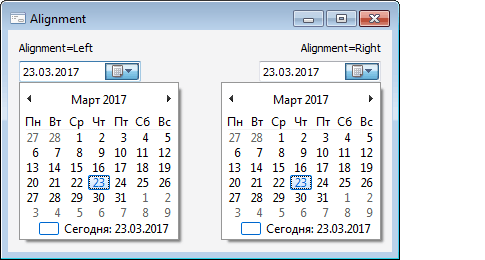

# IDateTimePicker.Alignment

IDateTimePicker.Alignment
-

# IDateTimePicker.Alignment

## Синтаксис

Alignment: [CalendarAlignment](../../Enums/CalendarAlignment.htm);

## Описание

Свойство Alignment определяет
 способ выравнивание раскрывающегося календаря относительно границ компонента.

## Пример

См. также:

[IDateTimePicker](IDateTimePicker.htm)

		Справочная
		 система на версию 10.9
		 от 18/08/2025,
		 © ООО «ФОРСАЙТ»,
