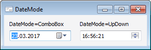

# IDateTimePicker.DateMode

IDateTimePicker.DateMode
-

# IDateTimePicker.DateMode

## Синтаксис

DateMode: [CalendarDateMode](../../Enums/CalendarDateMode.htm);

## Описание

Свойство DateMode определяет
 внешний вид компонента.

## Комментарии

Если свойству установлено значение [CalendarDateMode.ComboBox](../../Enums/CalendarDateMode.htm),
 то компонент используется для отображения и изменения значения даты. Дату
 можно изменять с помощью раскрывающегося календаря, либо ввести
 значение дня, месяца и года вручную. Если свойству установлено значение
 [CalendarDateMode.UpDown](../../Enums/CalendarDateMode.htm),
 то компонент используется для отображения и изменения значения времени.
 Время можно изменять с помощью кнопок SpinUp
 и SpinDown, либо ввести значение
 часа, минут и секунд вручную.

## Пример

См. также:

[IDateTimePicker](IDateTimePicker.htm)

		Справочная
		 система на версию 10.9
		 от 18/08/2025,
		 © ООО «ФОРСАЙТ»,
