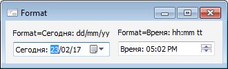

# IDateTimePicker.Format

IDateTimePicker.Format
-

# IDateTimePicker.Format

## Синтаксис

Format: String;

## Описание

Свойство Format определяет пользовательский
 формат отображения даты или времени.

## Комментарии

Значение свойства Format задается
 с помощью комбинации перечисленных ниже констант. Все остальные символы
 воспринимаются как текст и отображаются в компоненте без изменения. Если
 необходимо, чтобы одна или несколько констант воспринималась как текст,
 то укажите их между экранирующими апострофами. Например, при задании формата
 «hh 'h' mm 'm'» будет отображаться следующее значение: «10 h 35 m».

		 Константа
		 Описание

		 d
		 Отображает день как число без предшествующего нуля (1-31).

		 dd
		 Отображает день как число с предшествующим нулём (01-31).

		 ddd
		 Отображает день как аббревиатуру (Пн - Вс).

		 dddd
		 Отображает день полным названием (Понедельник - Воскресенье).

		 h
		 Отображает часы без предшествующего нуля в 12-ти часовом формате
		 (0-12).

		 hh
		 Отображает часы с предшествующим нулём в 12-ти часовом формате
		 (00-12).

		 H
		 Отображает часы без предшествующего нуля в 24-х часовом формате
		 (0-24).

		 HH
		 Отображает часы с предшествующим нулём в 24-х часовом формате
		 (00-24).

		 m
		 Отображает минуты без предшествующего нуля (0-59).

		 mm
		 Отображает минуты с предшествующим нулём (00-59).

		 M
		 Отображает месяц как число без предшествующего нуля (1-12).

		 MM
		 Отображает месяц как число с предшествующим нулём (01-12).

		 MMM
		 Отображает месяц как аббревиатуру (янв-фев).

		 MMMM
		 Отображает месяц полным названием (Январь - Февраль).

		 t
		 Отображает один символ обозначения времени до/после полудня.
		 Например, если задано обозначение AM/PM, то будет отображена буква
		 «А» или «P».
		Примечание.
		 Обозначение времени до/после полудня берется из настроек региональных
		 параметров.

		 tt
		 Отображает заданное обозначение времени до/после полудня. Например,
		 «АM» или «PM».
		Примечание.
		 Обозначение времени до/после полудня берется из настроек региональных
		 параметров.

		 yy
		 Отображает год двузначным числом (00-99).

		 yyyy
		 Отображает год четырехзначным числом (0000-9999).

		 s
		 Отображает секунды без предшествующего нуля (0-59).

		 ss
		 Отображает секунды с предшествующим нулём (00-59).

## Пример

См. также:

[IDateTimePicker](IDateTimePicker.htm)

		Справочная
		 система на версию 10.9
		 от 18/08/2025,
		 © ООО «ФОРСАЙТ»,
