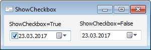

# IDateTimePicker.ShowCheckbox

IDateTimePicker.ShowCheckbox
-

# IDateTimePicker.ShowCheckbox

## Синтаксис

ShowCheckbox: Boolean;

## Описание

Свойство ShowCheckBox определяет,
 будет ли отображаться флажок в области компонента.

## Комментарии

Если свойству установлено значение True,
 то в области компонента будет отображаться флажок. Данный флажок используется
 для управления возможностью изменения значения в компоненте. Состояние
 флажка можно определить в свойстве [IDateTimePicker.Checked](IDateTimePicker.Checked.htm).

## Пример

См. также:

[IDateTimePicker](IDateTimePicker.htm)

		Справочная
		 система на версию 10.9
		 от 18/08/2025,
		 © ООО «ФОРСАЙТ»,
