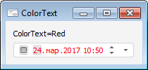

# IDateTimePickerEx.ColorText

IDateTimePickerEx.ColorText
-

# IDateTimePickerEx.ColorText

## Синтаксис

ColorText: [IGxColor](ModDrawing.chm::/Interface/IGxColor/IGxColor.htm);

## Описание

Свойство ColorText определяет
 цвет текста в поле редактирования компонента.

## Пример

См. также:

[IDateTimePickerEx](IDateTimePickerEx.htm)

		Справочная
		 система на версию 10.9
		 от 18/08/2025,
		 © ООО «ФОРСАЙТ»,
