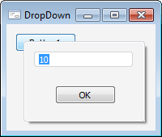

# IDropForm.DropDown

IDropForm.DropDown
-

# IDropForm.DropDown

## Синтаксис

DropDown(ParentControl: [IControl](../IControl/IControl.htm);
 X: Integer; Y: Integer);

## Параметры

ParentControl. Родительский
 компонент, относительно которого будет разворачиваться форма.

X. Координата Х в области компонента
 ParentControl, которая будет
 являться начальной точкой разворачивания формы. Координата указывается
 относительно верхнего левого угла компонента.

Y. Координата Y в области компонента
 ParentControl, которая будет
 являться начальной точкой разворачивания формы. Координата указывается
 относительно верхнего левого угла компонента.

## Описание

Метод DropDown осуществляет
 разворачивание формы.

## Пример

Для выполнения примера предполагается наличие формы, расположенной на
 ней кнопки с наименованием «Button1» и компонента DropForm с наименованием
 «DropForm1». Компонент «DropForm1» подключен к какой-либо форме.

			Sub Button1OnClick(Sender: Object; Args: IMouseEventArgs);

Begin

    DropForm1.DropHeight := 100;

    DropForm1.DropWidth := 150;

    DropForm1.DropDown(Sender As IControl, 10, 10);

End Sub Button1OnClick;

При нажатии на кнопку будет развернута форма, подключенная к компоненту
 «DropForm1"». Область развернутой формы будет иметь размер 100*150
 пикселей. Начальная позиция разворачивания формы будет смещена на 10 пикселей
 от верхнего левого края кнопки «Button1».

См. также:

[IDropForm](IDropForm.htm)

		Справочная
		 система на версию 10.9
		 от 18/08/2025,
		 © ООО «ФОРСАЙТ»,
