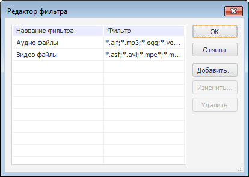

# IFileDialog.Filter

IFileDialog.Filter
-

# IFileDialog.Filter

## Синтаксис

Filter: String;

## Описание

Свойство Filter определяет текст
 фильтра для ограничения списка доступных файлов.

## Комментарии

Если фильтр задан, то доступными становятся только те файлы, наименование
 и расширение которых удовлетворяет условиям фильтра. В строке фильтра
 через символы «|» указывается
 различные категории файлов. Отдельные условия в одной категории разделяются
 между собой символом «;».

В режиме дизайнера формы условия фильтрации можно задать в редакторе фильтра.
 Окно «Редактор фильтра» вызывается при нажатии на кнопку 
 свойства Filter в инспекторе объектов
 или при выборе пункта контекстного меню «Фильтр» диалога открытия/сохранения
 файла.

В символьном виде установленный фильтр выглядит следующим образом:

Filter:="Аудио файлы|*.aif;*.mp3;*.ogg;*.voc;*.wav;*.wma|Видео
 файлы|*.asf;*.avi;*.mpe*;*.mpg;*.mpg4";

См. также:

[IFileDialog](IFileDialog.htm)

		Справочная
		 система на версию 10.9
		 от 18/08/2025,
		 © ООО «ФОРСАЙТ»,
