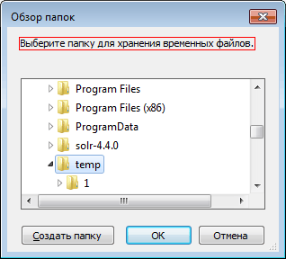

# IFolderBrowserDialog.Description

IFolderBrowserDialog.Description
-

# IFolderBrowserDialog.Description

## Синтаксис

Description: String;

## Описание

Свойство Description определяет
 описание, выводимое в области диалога обзора папок.

## Пример

См. также:

[IFolderBrowserDialog](IFolderBrowserDialog.htm)

		Справочная
		 система на версию 10.9
		 от 18/08/2025,
		 © ООО «ФОРСАЙТ»,
