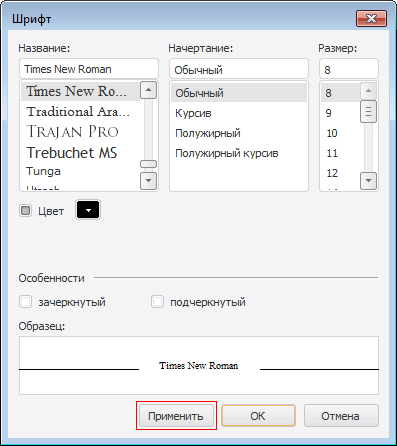

# IFontDialogOptions.ApplyButton

IFontDialogOptions.ApplyButton
-

# IFontDialogOptions.ApplyButton

## Синтаксис

ApplyButton: Boolean;

## Описание

Свойство ApplyButton определяет
 признак отображения в диалоге кнопки "Применить".

## Комментарии

При нажатии на данную кнопку выбранный шрифт будет установлен в свойстве
 [Font](../IFontDialog/IFontDialog.Font.htm), а также будет
 сгенерировано событие [OnApply](../../Class/FontDialog/FontDialog.OnApply.htm).
 По умолчанию свойству установлено значение False,
 при этом кнопка не отображается.

## Пример

См. также:

[IFontDialogOptions](IFontDialogOptions.htm)

		Справочная
		 система на версию 10.9
		 от 18/08/2025,
		 © ООО «ФОРСАЙТ»,
