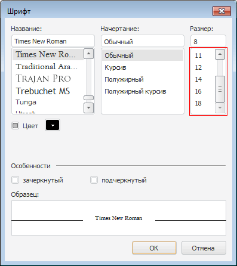

# IFontDialogOptions.LimitSize

IFontDialogOptions.LimitSize
-

# IFontDialogOptions.LimitSize

## Синтаксис

LimitSize: Boolean;

## Описание

Свойство LimitSize определяет
 признак ограничения доступных размеров шрифта при вызове диалога.

## Комментарии

Для установки допустимых размеров используются свойства [MinFontSize](../IFontDialog/IFontDialog.MinFontSize.htm)
 и [MaxFontSize](../IFontDialog/IFontDialog.MaxFontSize.htm).
 По умолчанию свойству LimitSize
 установлено значение False, при
 этом допустимые размеры шрифта определяются параметрами выбранного шрифта.

## Пример

Для выполнения примера предполагается наличие формы, расположенной на
 ней кнопки с наименованием «Button1» и компонента FontDialog с наименованием
 «FontDialog1».

			Sub Button1OnClick(Sender: Object; Args: IMouseEventArgs);

Begin

    FontDialog1.MinFontSize := 8;

    FontDialog1.MaxFontSize := 18;

    FontDialog1.Options.LimitSize := True;

    FontDialog1.Execute;

End Sub Button1OnClick;

При нажатии на кнопку будет вызван диалог выбора шрифта с ограниченной
 возможностью выбора размера шрифта:

См. также:

[IFontDialogOptions](IFontDialogOptions.htm) | [IFontDialog.MaxFontSize](../IFontDialog/IFontDialog.MaxFontSize.htm)
 | [IFontDialog.MinFontSize](../IFontDialog/IFontDialog.MinFontSize.htm)

		Справочная
		 система на версию 10.9
		 от 18/08/2025,
		 © ООО «ФОРСАЙТ»,
