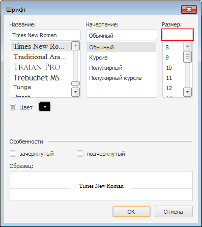

# IFontDialogOptions.NoSizeSel

IFontDialogOptions.NoSizeSel
-

# IFontDialogOptions.NoSizeSel

## Синтаксис

NoSizeSel: Boolean;

## Описание

Свойство NoSizeSel определяет
 признак выбора размера текущего шрифта в списке размеров диалога.

## Комментарии

Если свойству установить значение True,
 то при открытии диалога поле размера шрифта будет пустым. По умолчанию
 свойству установлено значение False,
 при этом в диалоге будет выбран размер шрифта компонента (Размер шрифта,
 установленного в свойстве [Font](../IFontDialog/IFontDialog.Font.htm)).

## Пример

См. также:

[IFontDialogOptions](IFontDialogOptions.htm)

		Справочная
		 система на версию 10.9
		 от 18/08/2025,
		 © ООО «ФОРСАЙТ»,
