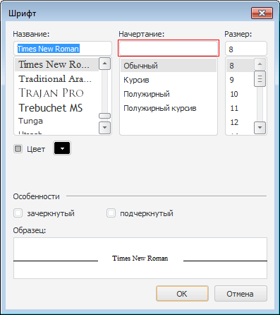

# IFontDialogOptions.NoStyleSel

IFontDialogOptions.NoStyleSel
-

# IFontDialogOptions.NoStyleSel

## Синтаксис

NoStyleSel: Boolean;

## Описание

Свойство NoStyleSel определяет
 признак выбора текущего стиля начертания шрифта в списке стилей начертания
 диалога.

## Комментарии

Если свойству установить значение True,
 то при открытии диалога поле стиля начертания шрифта будет пустым. По
 умолчанию свойству установлено значение False,
 при этом в диалоге будет выбран стиль начертания шрифта компонента (Стиль
 начертания шрифта, установленного в свойстве [Font](../IFontDialog/IFontDialog.Font.htm)).

## Пример

См. также:

[IFontDialogOptions](IFontDialogOptions.htm)

		Справочная
		 система на версию 10.9
		 от 18/08/2025,
		 © ООО «ФОРСАЙТ»,
