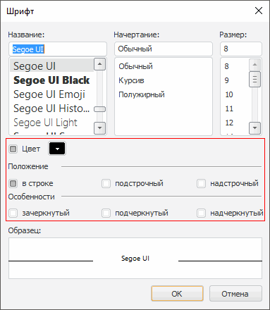

# IFontDialogOptions.ShowEffects

IFontDialogOptions.ShowEffects
-

# IFontDialogOptions.ShowEffects

## Синтаксис

ShowEffects: Boolean;

## Описание

Свойство ShowEffects определяет
 признак отображения элементов, позволяющих задавать параметры цвета, положения,
 зачеркивания и подчеркивания текста.

## Комментарии

По умолчанию свойству установлено значение True.
 Если свойству установить значение False,
 то элементы, позволяющие задавать параметры цвета, положения, зачеркивания
 и подчеркивания текста отображаться не будут.

## Пример

См. также:

[IFontDialogOptions](IFontDialogOptions.htm)

		Справочная
		 система на версию 10.9
		 от 18/08/2025,
		 © ООО «ФОРСАЙТ»,
