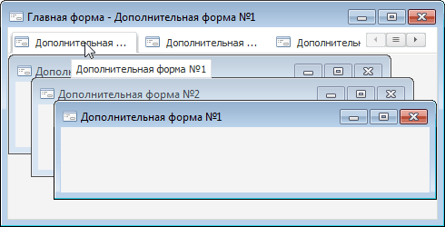

# IFormControl.MaxTabLength

IFormControl.MaxTabLength
-

# IFormControl.MaxTabLength

## Синтаксис

MaxTabLength: Integer;

## Описание

Свойство MaxTabLength определяет
 максимальную допустимую длину заголовка дочерней MDI-формы, при превышении
 которой в заголовке вкладки, соответствующей данной форме, будет отображаться
 сокращенный заголовок.

## Комментарии

По умолчанию свойству установлено значение 0, при этом в заголовке вкладки
 будет отображаться полный заголовок формы.

При установке свойству значения в диапазоне 10-255 символов, если длина
 заголовка дочерней MDI-форме больше указанного значения, то в заголовке
 соответствующей вкладки будет отображаться сокращенный заголовок. В конце
 заголовка будет добавлено многоточие. При наведении на заголовок будет
 отображаться всплывающая подсказка, содержащая полный заголовок дочерней
 MDI-формы.

Примечание.
 Свойство задается индивидуально для каждой дочерней MDI-формы.

## Пример

См. также:

[IFormControl](IFormControl.htm)

		Справочная
		 система на версию 10.9
		 от 18/08/2025,
		 © ООО «ФОРСАЙТ»,
