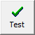

# IImageButton.ImageLayout

IImageButton.ImageLayout
-

# IImageButton.ImageLayout

## Синтаксис

ImageLayout: [ImageButtonLayout](../../Enums/ImageButtonLayout.htm);

## Описание

Свойство ImageLayout определяет
 способ расположения пиктограммы относительно текста компонента.

## Комментарии

По умолчанию свойству установлено значение GlyphLeft.

## Пример

При установке свойству значения GlyphTop кнопка примет вид:

См. также:

[IImageButton](IImageButton.htm)

		Справочная
		 система на версию 10.9
		 от 18/08/2025,
		 © ООО «ФОРСАЙТ»,
