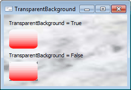

# IImageButton.TransparentBackground

IImageButton.TransparentBackground
-

# IImageButton.TransparentBackground

## Синтаксис

TransparentBackground: Boolean;

## Описание

Свойство TransparentBackground
 определяет признак использования прозрачного фона кнопки.

## Комментарии

TransparentBackground актуально
 для использования, если для различных состояний кнопки задано свойство
 [Background](../IImageButtonLook/IImageButtonLook.Background.htm)
 и изображения, которые заданы в [Background](../IImageButtonLook/IImageButtonLook.Background.htm),
 имеют прозрачные области. При установке свойству TransparentBackground
 значения True для кнопки будет
 использоваться прозрачный фон. При этом в тех местах, где у установленного
 в [Background](../IImageButtonLook/IImageButtonLook.Background.htm)
 изображения имеется прозрачная область, будет отображен фон родительского
 компонента текущей кнопки.

Примечание.
 Если компонент ImageButton расположен
 поверх безоконного компонента, то для корректного отображения прозрачных
 областей вся область ImageButton
 должна находится в рамках этого безоконного компонента.

По умолчанию свойству TransparentBackground
 установлено значение False, при
 этом в тех областях, где у изображения прозрачная область, будет отображена
 соответствующая часть кнопки.

Примечание.
 Данное свойство актуально, если для кнопки установлен стиль границы [ControlBorderStyle.None](../../Enums/ControlBorderStyle.htm)
 либо [ControlBorderStyle.Flat](../../Enums/ControlBorderStyle.htm).

## Пример

См. также:

[IImageButton](IImageButton.htm)

		Справочная
		 система на версию 10.9
		 от 18/08/2025,
		 © ООО «ФОРСАЙТ»,
