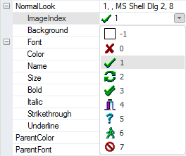
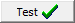

# IImageButtonLook.ImageIndex

IImageButtonLook.ImageIndex
-

# IImageButtonLook.ImageIndex

## Синтаксис

ImageIndex: Integer;

## Описание

Свойство ImageIndex определяет
 индекс изображения, которое будет отображаться на кнопке рядом с текстом.

## Комментарии

Источником изображений является компонент [ImageList](UiDevEnv.chm::/02_Components_constructor_forms/02_Additional_components/ImageList.htm)
 (либо [GlobalImageList](UiDevEnv.chm::/02_Components_constructor_forms/02_Additional_components/GlobalImageList.htm)),
 указанный в свойстве [Images](../IImageButton/IImageButton.Images.htm).

Свойство ImageIndex представляет
 собой комбинированный список, содержащий все загруженные изображения.

Если кнопка не содержит изображения, то в свойстве ImageIndex
 установлено значение «-1».

## Пример

При установке свойству [ImageLayout](../IImageButton/IImageButton.ImageLayout.htm)
 значения GlyphRight кнопка примет вид - .

См. также:

[IImageButtonLook](IImageButtonLook.htm)

		Справочная
		 система на версию 10.9
		 от 18/08/2025,
		 © ООО «ФОРСАЙТ»,
