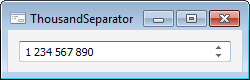

# IIntegerEdit.ThousandSeparator

IIntegerEdit.ThousandSeparator
-

# IIntegerEdit.ThousandSeparator

## Синтаксис

ThousandSeparator: Boolean;

## Описание

Свойство ThousandSeparator определяет,
 будет ли отображаться значение в компоненте с использованием разделителя
 групп разрядов.

## Комментарии

Допустимые значения:

	- True. Использовать разделитель
	 групп разрядов.

	- False. Значение по умолчанию.
	 Не использовать разделитель групп разрядов.

Для разделения групп разрядов используется разделитель, заданный в региональных
 настройках операционной системы.

## Пример

См. также:

[IIntegerEdit](IIntegerEdit.htm)

		Справочная
		 система на версию 10.9
		 от 18/08/2025,
		 © ООО «ФОРСАЙТ»,
