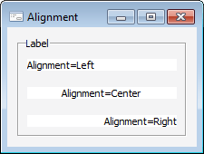

# ILabel.Alignment

ILabel.Alignment
-

# ILabel.Alignment

## Синтаксис

Alignment: [TextAlignment](../../Enums/TextAlignment.htm);

## Описание

Свойство Alignment определяет
 выравнивание текста по горизонтали.

## Пример

См. также:

[ILabel](ILabel.htm)

		Справочная
		 система на версию 10.9
		 от 18/08/2025,
		 © ООО «ФОРСАЙТ»,
