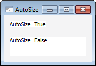

# ILabel.AutoSize

ILabel.AutoSize
-

# ILabel.AutoSize

## Синтаксис

AutoSize: Boolean;

## Описание

Свойство AutoSize определяет,
 будет ли производиться автоматический подгон размеров компонента под текст
 компонента.

## Пример

См.
 также:

[ILabel](ILabel.htm)

		Справочная
		 система на версию 10.9
		 от 18/08/2025,
		 © ООО «ФОРСАЙТ»,
