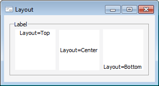

# ILabel.Layout

ILabel.Layout
-

# ILabel.Layout

## Синтаксис

Layout: [TextLayout](../../Enums/TextLayout.htm);

## Описание

Свойство Layout определяет выравнивание
 текста по вертикали.

## Пример

См.
 также:

[ILabel](ILabel.htm)

		Справочная
		 система на версию 10.9
		 от 18/08/2025,
		 © ООО «ФОРСАЙТ»,
