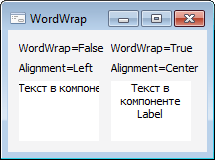

# ILabel.WordWrap

ILabel.WordWrap
-

# ILabel.WordWrap

## Синтаксис

WordWrap: Boolean;

## Описание

Свойство WordWrap определяет,
 будут ли переноситься слова длинной надписи, превышающие длину компонента,
 на новую строку.

## Комментарии

Допустимые значения:

	- True. Переносить слова
	 на новую строку;

	- False. Не переносить
	 слова на новую строку.

## Пример

См.
 также:

[ILabel](ILabel.htm)

		Справочная
		 система на версию 10.9
		 от 18/08/2025,
		 © ООО «ФОРСАЙТ»,
