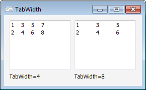

# IListBox.TabWidth

IListBox.TabWidth
-

# IListBox.TabWidth

## Синтаксис

TabWidth: Integer;

## Описание

Свойство TabWidth определяет
 ширину символа табуляции.

## Комментарии

Ширина символа табуляции указывается в пробелах. По умолчанию свойству
 TabWidth установлено значение
 0, при этом ширина символа табуляции соответствует ширине, используемой
 в операционной системе.

## Пример

См. также:

[IListBox](IListBox.htm)

		Справочная
		 система на версию 10.9
		 от 18/08/2025,
		 © ООО «ФОРСАЙТ»,
