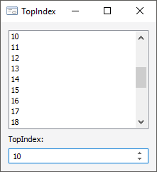

# IListBox.TopIndex

IListBox.TopIndex
-

# IListBox.TopIndex

## Синтаксис

TopIndex: Integer;

## Описание

Свойство TopIndex определяет
 индекс первой видимой в компоненте строки.

## Комментарии

Индексация строк осуществляется с нуля. При изменении значения свойства
 список строк будет прокручен таким образом, чтобы строка с индексом TopIndex была первой в видимой области
 компонента. Если указывается индекс одной из последних строк или индекс,
 который больше количества имеющихся строк, то осуществляется прокрутка
 до конца списка строк в компоненте.

## Пример

Для выполнения примера предполагается наличие формы, расположенного
 на ней компонента ListBox с наименованием «ListBox1» и компонента IntegerEdit
 с наименованием «IntegerEdit1». Для «IntegerEdit1» добавлен обработчик
 события «OnChange». Ниже указан полный код формы.

			Class TESTForm: Form

    ListBox1: ListBox;

    IntegerEdit1: IntegerEdit;

    Sub IntegerEdit1OnChange(Sender: Object; Args: IEventArgs);

    Begin

        ListBox1.TopIndex := IntegerEdit1.Value;

    End Sub IntegerEdit1OnChange;

End Class TESTForm;

При изменении значения в компоненте «IntegerEdit1» будет осуществляться
 прокрутка компонента «ListBox1» таким образом, чтобы первой видимой строкой
 была строка, индекс которой равен значению в «IntegerEdit1».

См. также:

[IListBox](IListBox.htm)

		Справочная
		 система на версию 10.9
		 от 18/08/2025,
		 © ООО «ФОРСАЙТ»,
