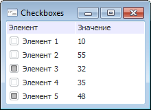
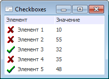

# IListView.Checkboxes

IListView.Checkboxes
-

# IListView.Checkboxes

## Синтаксис

Checkboxes: Boolean;

## Описание

Свойство Checkboxes определяет
 признак наличия флажков у элементов компонента [ListView](UiDevEnv.chm::/02_Components_constructor_forms/02_Additional_components/ListView.htm).

## Комментарии

Если свойству установлено значение True,
 то рядом с элементами компонента будут располагаться флажки. По умолчанию
 свойству установлено значение False,
 при этом флажки не отображаются.

Если для компонента установлено свойство [StateImages](IListView.StateImages.htm)
 и Checkboxes = True,
 то для отображения состояния флажка (отмечен/не отмечен) элементов будут
 использоваться два первых изображения из коллекции [StateImages](IListView.StateImages.htm),
 изображение с индексом 0 для не отмеченных, изображение с индексом 1 -
 для отмеченных флажков.

## Пример

Checkboxes=True; StateImages=Null;

Checkboxes=True; StateImages<>Null;

См. также:

[IListView](IListView.htm)

		Справочная
		 система на версию 10.9
		 от 18/08/2025,
		 © ООО «ФОРСАЙТ»,
