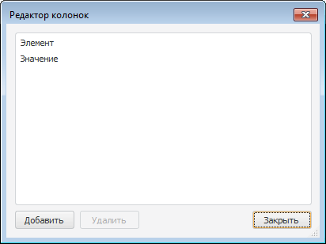

# IListView.Columns

IListView.Columns
-

# IListView.Columns

## Синтаксис

Columns: [IListViewColumns](../IListViewColumns/IListViewColumns.htm);

## Описание

Свойство Columns возвращает
 коллекцию столбцов компонента.

## Комментарии

Добавление и редактирование колонок осуществляется в окне «Редактор
 колонок». Для открытия данного окна следует:

	- выполнить пункт контекстного меню «Колонки»
	 для компонента ListView, расположенного
	 на форме;

	- нажать на кнопку 
	 свойства Columns компонента
	 ListView в инспекторе объектов;

	- дважды щёлкнуть по свойству Columns компонента
	 ListView в инспекторе объектов.

Окно «Редактор колонок» выглядит
 следующим образом:

Кнопка «Добавить» используется
 для добавления столбцов.

Примечание.
 Свойства выбранной в списке колонки определяются в [инспекторе
 объектов](UiDevEnv.chm::/01_Development_Environment/03_Windows_of_Development_Environment/Object_Inspector.htm).

Кнопка «Удалить» используется
 для удаления столбцов.

При нажатии на кнопку «Закрыть»
 данное окно будет закрыто.

См. также:

[IListView](IListView.htm)

		Справочная
		 система на версию 10.9
		 от 18/08/2025,
		 © ООО «ФОРСАЙТ»,
