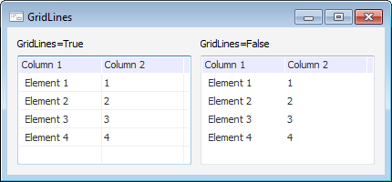

# IListView.GridLines

IListView.GridLines
-

# IListView.GridLines

## Синтаксис

GridLines: Boolean;

## Описание

Свойство GridLines определяет,
 будет ли отображаться сетка.

## Комментарии

По умолчанию свойству установлено значение False,
 при этом сетка не отображается. При установке значения True
 в компоненте будет отображаться
 сетка.

Свойство GridLines актуально,
 если для свойства [IListView.Style](IListView.Style.htm) установлено
 значение Report.

## Пример

См. также:

[IListView](IListView.htm)

		Справочная
		 система на версию 10.9
		 от 18/08/2025,
		 © ООО «ФОРСАЙТ»,
