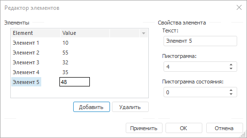
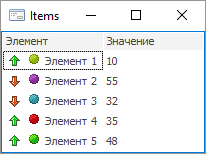

# IListView.Items

IListView.Items
-

# IListView.Items

## Синтаксис

Items: [IListViewItems](../IListViewItems/IListViewItems.htm);

## Описание

Свойство Items возвращает коллекцию
 всех элементов компонента [ListView](UiDevEnv.chm::/02_Components_constructor_forms/02_Additional_components/ListView.htm).

## Комментарии

Добавление элементов и редактирование их свойств осуществляется в окне
 «Редактор элементов». Для открытия
 данного окна следует:

	- выбрать пункт контекстного меню «Элементы»
	 для компонента, расположенного на форме;

	- нажать на кнопку 
	 свойства Items компонента
	 в инспекторе объектов;

	- дважды щёлкнуть по свойству Items компонента
	 в инспекторе объектов.

Каждый элемент может содержать пиктограмму и текст. Если в компоненте
 содержится более одной колонки, то для редактирования значения элемента
 в другой колонке необходимо осуществить одиночный щелчок мыши на пересечении
 выбранного элемента и нужной колонки. По истечению нескольких секунд будет
 открыто окно редактирования значения.

Для отображения рядом с наименованием элемента пиктограммы,
 в зависимости от значения свойства [Style](IListView.Style.htm),
 необходимо в свойствах [LargeImages](IListView.LargeImages.htm),
 [SmallImages](IListView.SmallImages.htm) выбрать компонент
 [ImageList](UiDevEnv.chm::/02_Components_constructor_forms/02_Additional_components/ImageList.htm)
 (либо [GlobalImageList](UiDevEnv.chm::/02_Components_constructor_forms/02_Additional_components/GlobalImageList.htm)).
 Индекс пиктограммы, отображаемой рядом с наименованием элемента, выбирается
 в поле редактирования "Пиктограмма" редактора элементов, либо
 в свойстве [ImageIndex](../IListViewItem/IListViewItem.ImageIndex.htm).

Также для каждого элемента можно добавить вторую пиктограмму, позволяющую
 отображать дополнительное состояние элемента (Пиктограмма
 состояния). Для этого необходимо в свойстве [StateImages](IListView.StateImages.htm)
 выбрать компонент [ImageList](UiDevEnv.chm::/02_Components_constructor_forms/02_Additional_components/ImageList.htm)
 (либо [GlobalImageList](UiDevEnv.chm::/02_Components_constructor_forms/02_Additional_components/GlobalImageList.htm)).
 Индекс дополнительной пиктограммы, отображаемой рядом с наименованием
 элемента, выбирается в поле редактирования "Пиктограмма состояния"
 редактора элементов, либо в свойстве [StateIndex](../IListViewItem/IListViewItem.StateIndex.htm).

## Пример

См. также:

[IListView](IListView.htm)

		Справочная
		 система на версию 10.9
		 от 18/08/2025,
		 © ООО «ФОРСАЙТ»,
