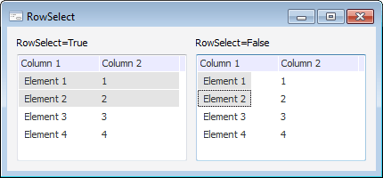

# IListView.RowSelect

IListView.RowSelect
-

# IListView.RowSelect

## Синтаксис

RowSelect: Boolean;

## Описание

Свойство RowSelect определяет
 необходимость выделения выбранного элемента подсветкой всей строки.

## Комментарии

Если свойству RowSelect установлено
 значение True, то подсветкой будет
 выделяться вся строка, в которой находится выбранный элемент. При установке
 значения False, будет выделяться
 только сам элемент.

Свойство RowSelect актуально,
 если свойству [IListView.Style](IListView.Style.htm) установлено
 значение [Report](../../Enums/ListViewStyle.htm).

## Пример

См. также:

[IListView](IListView.htm)

		Справочная
		 система на версию 10.9
		 от 18/08/2025,
		 © ООО «ФОРСАЙТ»,
