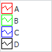

# IListView.SmallImages

IListView.SmallImages
-

# IListView.SmallImages

## Синтаксис

SmallImages: [IImageList](../IImageList/IImageList.htm);

## Описание

Свойство SmallImages определяет источник маленьких пиктограмм.

## Комментарии

В список доступных значений свойства входят компоненты [ImageList](UiDevEnv.chm::/02_Components_constructor_forms/02_Additional_components/ImageList.htm) и [GlobalImageList](UiDevEnv.chm::/02_Components_constructor_forms/02_Additional_components/GlobalImageList.htm). Маленькие изображения для элементов отображаются, если для компонента установлен любой [стиль](IListView.Style.htm), отличный от [Icon](../../Enums/ListViewStyle.htm). Индексы изображения для элементов задаются в свойстве [IListViewItem.ImageIndex](../IListViewItem/IListViewItem.ImageIndex.htm).

## Пример

См. также:

[IListView](IListView.htm)

		Справочная
		 система на версию 10.9
		 от 18/08/2025,
		 © ООО «ФОРСАЙТ»,
