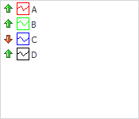

# IListView.StateImages

IListView.StateImages
-

# IListView.StateImages

## Синтаксис

StateImages: [IImageList](../IImageList/IImageList.htm);

## Описание

Свойство StateImages определяет
 список изображений, используемых для индикации состояния элементов.

## Комментарии

В список доступных значений свойства входят компоненты [ImageList](UiDevEnv.chm::/02_Components_constructor_forms/02_Additional_components/ImageList.htm)
 и [GlobalImageList](UiDevEnv.chm::/02_Components_constructor_forms/02_Additional_components/GlobalImageList.htm).

При заданном свойстве StateImages
 режим работы также зависит от значения свойства [Checkboxes](IListView.Checkboxes.htm):

	- [Checkboxes](IListView.Checkboxes.htm) = True.
	 Для отображения состояния флажка элементов (отмечен/не отмечен) будут
	 использоваться два первых изображения из коллекции StateImages,
	 изображение с индексом 0 для не отмеченных, изображение с индексом
	 1 - для отмеченных флажков.

	- [Checkboxes](IListView.Checkboxes.htm) = False.
	 Используя свойство [IListViewItem.StateIndex](../IListViewItem/IListViewItem.StateIndex.htm),
	 для каждого элемента можно установить свое изображение состояния из
	 коллекции StateImages.

## Пример

См. также:

[IListView](IListView.htm)

		Справочная
		 система на версию 10.9
		 от 18/08/2025,
		 © ООО «ФОРСАЙТ»,
